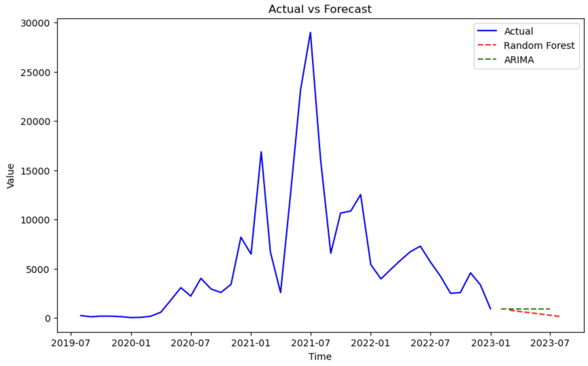

# Time Series Forecasting

This report will go through the steps that have been implemented to perform a time series forecasting.
### Table of contents
1.[Prerequisites](#Prerequisite)
2.[Goal and Data](#Goal-and-Data)
3.[Preprocessing](#Preprocessing)
4.[Models](#Models)
5.[Forecasts and Graphs](#Forecasts-and-Graphs)
6.[Conclusions](#Conclusions)

### Prerequisites
The code has been developed using python 3.8.16.
To install the necessary libraries, run the following command:
`pip install -r requirements.txt`

### Goal and Data
The goal of the code is the one of **training models** for three products and then **forecast** the next <u>6 months</u> sales values.
The dataset was composed by the 'Product' column, the Date column and the 'Sales' column that represented the amount of unit sold by a product in a precise month.
The products listed in the dataset were 3, called respectively 'ProductA', 'ProductB' and 'ProductC'; whose observations were not that many (43 on average for each product).
The 'Mont' variable was the one containing information about the date, sales were recorded on a monthly basis for 4 years from 2019 to 2022.

### Preprocessing
In the preprocessing part, after having printed some statistics of the dataset like null values, duplicates, mean and sd of sales value, it has been displayed the distribution of the three products in terms of sales.

From the graphs, what could have been observed was:
- For **Product A**, there appears to be a pattern of seasonality, as most of the peaks occur around *May and June*, and significant declines are noted close to *December and January*.

- In contrast, **Product B** does not exhibit the same seasonal pattern. Instead, its sales display a rollercoaster-like behavior throughout *2021*, with sudden increases followed by declines, suggesting a more erratic sales pattern without clear seasonality but with an increaasing and decreasing trend.

-  **Product C** shows a return to seasonal behavior, similar to what is observed for Product A. Sales peaks are evident in *May and June*, with drops around *September and October*. Additionally, a decreasing trend is noticeable, as the peaks become progressively lower over time.

These glimpses were confirmed when each product distribution have been decomposed into its <u>*Trend*</u>, <u>*Seasonal*</u> and <u>*Residual*</u> component.

Something else that caught the attention looking at the graphs was that <u>none</u> of our Products is **stationary**.

>Stationarity means that the <u>statistical properties</u> of a process generating a time series do not change over time. 

 Long story short it means that our time series should not have a trend or a seasonal behavior. 

Since the non-stationary behavior of our three time series could have had a negative effect in the forecasting step, we should have made them stationary before building the model.
The aforementioned processe was performed by a function that, for each product, at each step was performing the ADF (augmented Dickey Fuller) test to check stationarity of the time serie and , in the case in which the p-value of the test turned out to be negative, it was differentiating the time series and again recomputing the ADF test.
The output of the function, at the end, was telling how many times each product's time serie needed to be differentiated. 
According to the function it seemed that the sales time series about **Product B** and **Product C** needed to be differentiated 1 time in order to be stationary, while the time serie about **Product A** didn't need any differentiation.
This reasoning makes sense mathematically, according to the ADF test but it doesn't graphically since it was clear that sales of **Product A** followed a seasonal pattern. 
So it was decided to proceed to differentiate also the sales values regarding **Product A** .

### Models
In order to forecast the next 6 months sales for each product some models were built.
The models chosen were:

-  **ARIMA**, an auto regressive moving average models, a model quite used when dealing with time series forecasting, often used to set a <u>*treshold*</u> to evaluate other models performances.

-  **Ensamble learning methods**(XGB and Random Forest), they are very powerful machine learning methods quite used when dealing with time series too.

They have been preferred to neural networks because they are computationally less expensive and almost the same (also even better sometimes) in terms of performances.

Moreover the way models' performances had been evaluated was using the e **MAPE** (mean absolute percentage error) score that was telling us how much the predictions would have been wrong in percentage terms. This metric was preferred to others like RMSE because it doesn't depend on the scale of the data and it is easier to interpret.

#### Arima
To fit the ARIMA model it was fundamental to find the best parameters for the model. To fulfill this task we used the auto_arima function from the pmdarima library, that was automatically choosing the best values for the P and Q values that the ARIMA model needs.
Notice that the D parameter was already known since we had already differenced the time series.
Notice also that the auto.arima function wants as input the time series in a non-differenced form, so we needed to take the original time series and split it into train and test sets just for this occasion.
From the output of the function was clear that the MAPE values for each product, both on the training and on the test set are not so satisfying.
The best performances are in the case of Product A and the worst one are in the case of Product B.

#### XGB
For the XGB model since some X features to use are needed they have been construct manually. You are maybe guessing how...well it is a common practice when dealing with time series to consider the *previous lags* and also the *month*  and the *day* corresponding to the sales.
This practice was done for each of the product.
Moreover to find the best hyperparameters rather than tuning them manually or using a grid search, the Optuna library have been used.

>Optuna is a hyperparameter optimization framework that uses a technique called Tree-structured Parzen Estimator (TPE) to find the best hyperparameters for a model.

Perforomances in this case were terrifying, despite the use of Optune all the models had very high MAPE values, some of them were even above 100%.

#### Random Forest
The approach for random forest have been exactly the same used for XGB. 
In this case performances of the models were quite good, for all of the models both on training and test set.
For this reason Random Forest was the model used to perform the 6 months forecast.

### Forecasts and Graphs
After having trained the models the next step was forecasting the sales value for each product for the next 6 months.
If on one side for the arima model was easier to predict these values, for XGB and Random Forrest it was a bit more difficult. It was needed, indeed, to put the forecasted values as lagged values at each step of the prediction.

The following steps have been undertaken:

- Preparing the data: from the original dataset we needed to filter according to the product whose sales needed to be forecasted, and to apply all the transformation that have been applied to the data before training the models. The latter have been done because train and test split were no more needed.

- Forecasting the values using the models previously trained.

- Putting the forecasted values in the dataframe updating each time the lags.

- Since our models have been trained on differentiated dataframes, the prediction outputs are differences so transforming them back to actual sales values before considering them as final predictions was needed

Each of this steps was done using some built functions.

From the section before what could have been noticed was that the XGBoost model was very bad in terms of MAPE score, way worse than our threshold model Arima; while the performances of Random Forrest models were quite good.

For this reason only the random forrest models have been used to forecast the next 6 months sales (together with the Arima model to make some comparisons).

The results of predictions can be seen in the graphs below.
**Product A**

**ProductB**

**ProductC**

### Conclusions
To conclude can stated that the random forest model performed quite well and could have been grasped from MAPE values is somehow confirmed alo looking at the graphs. The prediction line, in each of the cases, doesn't have strange behaviors but seems to follow the pattern of the latest observed values.
About the forecasts themselves it is clear how for product B future is not bright, it is indeed forecasted to go on with a decreasing pattern. It can't be said the same thing for product A and product C that are forecasted to have a great increase in sales in the future 6 Months.

Summing up this code illustrates the procedure to  undertake a time series forecasting of a product, checking data, performing cleaning operations, training models and predicting an outcome.

